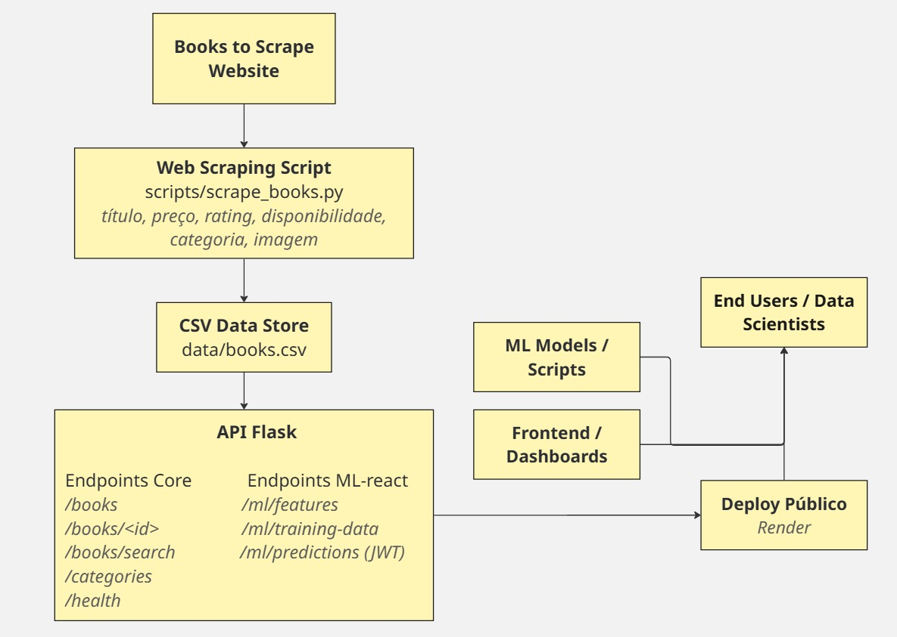

# Tech Challenge - API Books

## Descrição do Projeto

Este projeto faz parte do **Tech Challenge** e consiste em uma **API RESTful em Flask** para consulta de livros, utilizando dados extraídos do site [Books to Scrape](https://books.toscrape.com/).

A API é projetada para **escalabilidade**, **segurança** (JWT) e pronta para consumo por **cientistas de dados**, **sistemas de recomendação** ou **aplicações web**. Possui endpoints para listar, buscar, consultar detalhes de livros, listar categorias, verificar a saúde da API, endpoints ML-ready e um dashboard interativo em Streamlit.

**Objetivos técnicos:**

* Web scraping robusto de todos os livros do site, incluindo título, preço, rating, disponibilidade, categoria e imagem.
* API RESTful funcional com endpoints core e insights.
* Sistema de autenticação JWT para proteger rotas sensíveis.
* Pipeline ML-ready para consumo de modelos de machine learning.
* Dashboard de métricas e visualização de dados interativa.

---

## Estrutura do Projeto

```
tech-challenge-books-api/
│
├── .venv/                  # Ambiente virtual (não versionar)
├── api/
│   └── app.py              # API Flask principal
├── data/
│   └── books.csv           # CSV com dados coletados
├── scripts/
│   └── scrape_books.py     # Script de web scraping
├── static/
│   └── style.css           # Arquivos estáticos da interface
├── templates/
│   └── index.html          # Página inicial da API
├── docs/
│   └── diagrama-visual.png # Diagrama do pipeline e arquitetura
├── dashboard.py            # Dashboard Streamlit
├── tests/                  # Testes unitários
├── requirements.txt        # Dependências do projeto
└── README.md               # Documentação do projeto
```

---

## Diagramas e Arquitetura



**Descrição:** Pipeline completo desde **extração → transformação → API → consumo**. Pensado para **escalabilidade futura** e integração com **modelos de ML**.

---

## Pré-requisitos

* Python 3.10+
* [Git](https://git-scm.com/)
* [pip](https://pip.pypa.io/en/stable/)

---

## Instalação e Execução Local

1. **Clonar o repositório:**

```bash
git clone https://github.com/ErosNicolino/tech-challenge-books-api.git
cd tech-challenge-books-api
```

2. **Criar e ativar o ambiente virtual:**

```bash
python -m venv .venv

# Windows
.venv\Scripts\activate

# Linux/Mac
source .venv/bin/activate
```

3. **Instalar dependências:**

```bash
pip install -r requirements.txt
```

4. **Executar a API:**

```bash
python api/app.py
```

API disponível em: **[https://tech-challenge-books-api-mkqn.onrender.com](https://tech-challenge-books-api-mkqn.onrender.com)**

5. **Executar o dashboard (Streamlit):**

```bash
streamlit run dashboard/dashboard.py
```

Dashboard disponível em: **[https://tech-challenge-books-api-1.onrender.com](https://tech-challenge-books-api-1.onrender.com)**

---

## Documentação Interativa (Swagger)

[Swagger UI](https://tech-challenge-books-api-mkqn.onrender.com/apidocs)

---

## Endpoints da API

### Autenticação JWT

* **Login:** `POST /api/v1/auth/login`

**Request Body:**

```json
{
  "username": "admin",
  "password": "password123"
}
```

**Response:**

```json
{
  "access_token": "seu_token_jwt_aqui",
  "refresh_token": "seu_refresh_token_aqui"
}
```

* **Refresh Token:** `POST /api/v1/auth/refresh` (JWT required)

---

### Endpoints Core

* `GET /api/v1/books` → Listar todos os livros

**Exemplo:**

```bash
curl -X GET "https://tech-challenge-books-api-mkqn.onrender.com/api/v1/books?page=1&limit=5"
```

* `GET /api/v1/books/<id>` → Detalhes de um livro

* `GET /api/v1/books/search?title=&category=` → Buscar livros

* `GET /api/v1/categories` → Listar categorias

* `GET /api/v1/health` → Health check da API

**Exemplo de Response Health:**

```json
{
  "status": "ok",
  "books_count": 1000
}
```

---

### Endpoints Insights / Estatísticas

* `GET /api/v1/stats/overview` → Estatísticas gerais
* `GET /api/v1/stats/categories` → Estatísticas por categoria
* `GET /api/v1/books/top-rated` → Top 10 livros por rating
* `GET /api/v1/books/price-range?min=&max=` → Livros por faixa de preço

**Exemplo de Estatísticas Gerais:**

```json
{
  "total_books": 1000,
  "average_price": 45.3,
  "rating_distribution": {"Three": 300, "Four": 250, "Two": 200, "Five": 150, "One": 100}
}
```

---

### Endpoints ML-ready

* `GET /api/v1/ml/features` → Dados formatados para features
* `GET /api/v1/ml/training-data` → Dataset para treinamento ML
* `POST /api/v1/ml/predictions` → Recebe predições (JWT required)

**Exemplo de Request Prediction:**

```json
{
  "price": 25.0,
  "category_code": 3,
  "rating_num": 4
}
```

**Exemplo de Response Prediction:**

```json
{
  "predicted_price": 42.0
}
```

---

## Atualizando os Dados

```bash
python scripts/scrape_books.py
```

Depois commit e push:

```bash
git add data/books.csv
git commit -m "Update books data"
git push origin main
```

---

## Testes

```bash
pytest
```

---

## Dashboard

* Visualiza métricas gerais, distribuições, top 10 livros por preço e rating.
* Filtragem interativa por categoria e faixa de preço.
* Métricas da API e estatísticas por categoria via API.

---

## Contribuição

1. Fork do projeto
2. Criar branch feature: `git checkout -b minha-feature`
3. Commitar alterações: `git commit -m "Minha feature"`
4. Push para o branch: `git push origin minha-feature`
5. Abrir Pull Request

---

## Licença

MIT License. Consulte o arquivo `LICENSE`.

---

## Vídeo de Apresentação

Em andamento – será adicionado link do vídeo com demonstração de chamadas reais à API, dashboard e arquitetura.
